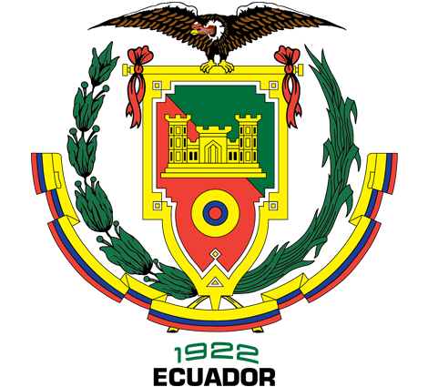

<div align="center">



# Portal de Emprendimientos ESPE

**Universidad de las Fuerzas Armadas ESPE**  

[](https://hub.docker.com)
[](https://nginx.org)
[](https://developer.mozilla.org/es/docs/Web/HTML)
[](https://developer.mozilla.org/es/docs/Web/CSS)
[](https://developer.mozilla.org/es/docs/Web/JavaScript)

</div>

---

## 📋 Descripción

Portal web institucional para **registrar, visualizar y analizar emprendimientos universitarios** vinculados a la ESPE. Desarrollado con HTML5, CSS3 y JavaScript puro (Vanilla JS), sin dependencias externas de frameworks. Utiliza **LocalStorage** para persistencia de datos en el navegador.

---

## 🗂️ Estructura del Proyecto

```
PORTAL_EMPRENDIMINETOS_UFA-ESPE/
├── src/
│   ├── assets/
│   │   ├── icons/
│   │   │   └── Logo_ESPE.ico
│   │   └── img/
│   │       └── Logo_ESPE.png
│   ├── css/
│   │   └── styles.css          ← Estilos institucionales ESPE
│   └── js/
│       └── app.js              ← Lógica completa de la aplicación
├── index.html                  ← SPA con las 5 páginas
├── Dockerfile                  ← Imagen basada en Nginx Alpine
├── .dockerignore               ← Evita que se suban archivos innecesarios al DockerHub 
├── LICENSE                     ← Licencia del repositorio
├── README.md                   ← Archivo Readme
```

---

## 🖥️ Páginas de la Aplicación

| # | Página | Descripción |
|---|--------|-------------|
| 1 | **Inicio** | Banner institucional, estadísticas en tiempo real, descripción del ecosistema ESPE y accesos rápidos por categoría |
| 2 | **Emprendimientos** | Catálogo en cards con búsqueda, filtro por categoría, edición y eliminación |
| 3 | **Registro** | Formulario validado para registrar nuevos emprendimientos |
| 4 | **Dashboard** | KPIs, tabla dinámica filtrable, top emprendimiento por ventas |
| 5 | **Contacto** | Información institucional y formulario de contacto |

---

## ⚙️ Funcionalidades

- ✅ Registro de emprendimientos con validación de campos
- ✅ Búsqueda por nombre o código
- ✅ Filtro por categoría
- ✅ Cálculo automático de: total, ventas totales, promedio de ventas
- ✅ Emprendimiento con mayores ventas (resaltado con 🏆)
- ✅ **LocalStorage** — los datos persisten al recargar la página
- ✅ Datos de muestra precargados (6 emprendimientos)
- ✅ Diseño responsive (móvil, tablet, escritorio)
- ✅ Notificaciones toast al registrar, editar y eliminar

---

## 🚀 Uso de la Aplicación

### Registrar un emprendimiento
1. Ir a la sección **Registro** desde el menú
2. Completar todos los campos obligatorios (marcados con `*`)
3. Hacer clic en **Registrar Emprendimiento**
4. El sistema redirige automáticamente al catálogo

### Buscar y filtrar
- Usar la barra de búsqueda por nombre o código
- Usar el selector de categorías para filtrar
- Los filtros aplican en tiempo real

---

## 🐳 Docker — Construcción y Publicación en Docker Hub

### 1. Construir la imagen localmente

```bash
# Desde la raíz del proyecto (donde está el Dockerfile)
docker build -t portal-emprendimientos-espe:1.0 .
```

### 2. Etiquetar para Docker Hub

Reemplaza `m3nm4` con tu nombre de usuario de Docker Hub:

```bash
docker tag portal-emprendimientos-espe:1.0 m3nm4/portal-emprendimientos-espe:1.0
docker tag portal-emprendimientos-espe:1.0 m3nm4/portal-emprendimientos-espe:latest
```

### 3. Iniciar sesión y subir a Docker Hub

```bash
# Iniciar sesión
docker login

# Subir la imagen
docker push m3nm4/portal-emprendimientos-espe:1.0
docker push m3nm4/portal-emprendimientos-espe:latest
```

---

## 📥 Despliegue desde Docker Hub

Una vez que la imagen está publicada en Docker Hub, cualquier persona puede ejecutarla con un solo comando — **sin necesidad de tener el código fuente**.

### ▶️ Comando directo (más simple)

```bash
docker run -d --name portal-espe -p 8080:80 --restart unless-stopped m3nm4/portal-emprendimientos-espe:latest
```

Abrir en el navegador: **http://localhost:8080**

---

### ▶️ Con puerto personalizado

```bash
# Cambiar 8080 por el puerto que prefieras
docker run -d --name portal-espe -p 3000:80 tu-usuario/portal-emprendimientos-espe:latest
```

Abrir en el navegador: **http://localhost:3000**


---

## 🛠️ Comandos Docker útiles

```bash
# Ver el contenedor corriendo
docker ps

# Ver logs del contenedor
docker logs portal-espe

# Detener el contenedor
docker stop portal-espe

# Eliminar el contenedor
docker rm portal-espe

# Actualizar a la última versión de la imagen
docker pull m3nm4/portal-emprendimientos-espe:latest
docker stop portal-espe && docker rm portal-espe
docker run -d --name portal-espe -p 8080:80 m3nm4/portal-emprendimientos-espe:latest
```

---

## 🛠️ Tecnologías utilizadas

| Tecnología | Uso |
|------------|-----|
| HTML5 | Estructura semántica — SPA con 5 páginas |
| CSS3 | Flexbox, Grid, Variables CSS, animaciones, responsive |
| JavaScript ES6+ | CRUD, LocalStorage, validaciones, filtros, estadísticas |
| Nginx Alpine | Servidor web liviano para producción |
| Docker | Contenedorización y portabilidad |

---

## 📌 Categorías disponibles

`💻 Tecnología` · `🥗 Alimentos` · `🔧 Servicios` · `📚 Educación` · `🌿 Ambiente` · `🎨 Artesanías` · `❤️ Salud` · `⭐ Otro`

## 📌 Estados de emprendimiento

`💡 Idea` · `🔬 Prototipo` · `🚀 En marcha` · `📈 En crecimiento`

---

<div align="center">

© 2026 · Universidad de las Fuerzas Armadas ESPE   
Sangolquí, Ecuador · [www.espe.edu.ec](https://www.espe.edu.ec)

</div>